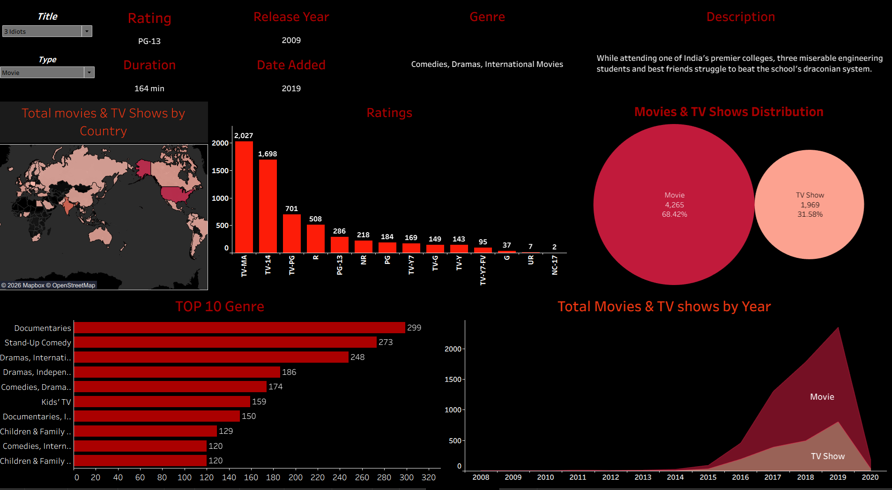

# Netflix Content Analysis Dashboard 📊

An interactive Tableau dashboard developed to analyze Netflix movies and TV shows and identify important content trends and patterns.

## 📌 Project Overview

This project analyzes Netflix content based on:

- Movies vs TV Shows
- Genres
- Ratings
- Countries
- Release Year
- Date Added
- Content distribution and trends

The dashboard converts raw Netflix data into interactive visualizations that make it easier to explore and understand the platform's content library.

## 📊 Dashboard Preview

## 🛠️ Tools & Technologies

- Tableau
- Data Visualization
- Data Analysis
- Interactive Dashboards
- Data Cleaning & Transformation

## 🔍 Key Features

- Interactive filters for exploring Netflix content
- Movie vs TV Show comparison
- Content analysis by country
- Top genre analysis
- Ratings distribution
- Year-wise content analysis
- Interactive visual exploration

## 🎯 Project Objective

The objective of this project is to analyze Netflix's content library and present meaningful insights through an interactive Tableau dashboard.

## 📂 Project Files

- `tabluea nk.twbx` – Tableau packaged workbook
- `screenshots/dashboard.png` – Dashboard preview

## 👤 Author

**Nithishkumar-45**
